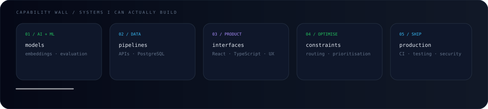

   

  
  
  

---

## Electronics & Computer Engineering · AI · Data · Systems

**JIIT Noida · Electronics & Computer Engineering · AI · Data · Systems · Product**

I build software where **AI, data, systems and real-world constraints** meet — with a bias toward **useful products, inspectable decisions and engineering that survives contact with reality.**

---

## Recruiter snapshot

<table>
<tr>
<td width="34%" align="center"><strong>ECM STUDENT</strong> JIIT Noida · Electronics & Computer Engineering</td>
<td width="33%" align="center"><strong>BUILDER</strong> AI · data · systems · product engineering</td>
<td width="33%" align="center"><strong>PROOF</strong> GitGlobe · Nirdhoom · Saathi · JYC 128</td>
</tr>
</table>

**What you can expect:** projects I can point to, engineering decisions I can explain, and honest boundaries around what is prototype, simulated, provider-backed or shipped.

> **Engineering principle:** clarity over cleverness · evidence over assumptions · useful software over feature count.

---

## Selected work

### 01 · Nirdhoom — Field operations
**A field-first coordination platform for crop-residue management.**

> **Engineering proof:** field workflows · booking · dispatch · operator evidence · verification · OR-Tools

Nirdhoom models the operational chain from **field → service → evidence → residue → buyer**. The current repository is a **prototype / integration foundation**, with demo and indicative data explicitly separated from real-world outcomes.

`React 19` `Vite 8` `Supabase` `PostgreSQL` `Leaflet` `OR-Tools` `PWA`

**[Repository →](https://github.com/kaustubhdua/nihdhoom)**

---

### 02 · Saathi — Voice + AI systems
**Voice-first, multilingual assistance designed around real service workflows.**

> **Engineering proof:** deterministic routing · provider adapters · provenance · consent · human escalation · readiness gates

Saathi combines source-backed answers with deterministic intent routing and provider boundaries. Its architecture deliberately separates **simulated capabilities from provider-backed integrations**, making the system easier to test, inspect and extend.

`Next.js` `React` `FastAPI` `Python` `Voice` `AI` `Supabase`

**[Repository →](https://github.com/kaustubhdua/Saathi)**

---

### 03 · JYC 128 — Product engineering
**A public-facing website engineered as a maintained software product.**

> **Engineering proof:** accessibility · SEO · media provenance · CI · CodeQL · Playwright · release hardening

JYC 128 is the official JIIT Youth Club website. The project demonstrates the less-visible side of shipping software: content architecture, accessibility, security checks, automated quality gates, responsive behaviour and browser-level verification.

`React` `Vite` `Supabase` `Playwright` `GitHub Actions` `CodeQL`

**[Repository →](https://github.com/kaustubhdua/JYC-Website)**

---

### 04 · Smart Waste — ML + optimisation
**An end-to-end waste collection pipeline connecting prediction to routing.**

> **Engineering proof:** time-series features · Random Forest prediction · priority scoring · OR-Tools route optimisation

Smart Waste predicts future bin fill levels, converts operational conditions into a continuous collection-priority score, then uses route optimisation to connect prediction with dispatch decisions.

`Python` `Pandas` `scikit-learn` `Random Forest` `Google OR-Tools` `ML`

**[Repository →](https://github.com/kaustubhdua/smart_waste_project)**

---

### Secondary work

| Project | Engineering signal |
|---|---|
| **[AkashChalak](https://github.com/kaustubhdua/AkashChalak)** | Satellite-assisted air-quality analysis, spatial interpolation and hotspot detection |
| **[Satark](https://github.com/kaustubhdua/Satark)** | Security-awareness workflows, AI-assisted analysis, explainability and safer interaction design |
| **[Smart Bike Taxi](https://github.com/kaustubhdua/Smart_bike_taxi_platform)** | C++17 data structures, shortest-path routing and nearest-driver dispatch |
| **[JIIT Toppers](https://github.com/kaustubhdua/Jiit-toppers-)** | Student product concept with academic tooling, trust boundaries and campus workflows |

**[Explore all repositories →](https://github.com/kaustubhdua?tab=repositories)**

> **Ownership rule:** the four projects above are presented as work in your own repositories. Collaborative work and forks are not represented as sole-authored projects.

## Engineering toolkit

<table>
<tr><td><strong>AI / ML</strong></td><td>Python · scikit-learn · embeddings · model evaluation · AI workflows</td></tr>
<tr><td><strong>Data / backend</strong></td><td>PostgreSQL · Supabase · FastAPI · APIs · data pipelines</td></tr>
<tr><td><strong>Product / web</strong></td><td>React · Next.js · TypeScript · Vite · Three.js · Leaflet</td></tr>
<tr><td><strong>Optimisation</strong></td><td>OR-Tools · routing · prioritisation · constraint-based systems</td></tr>
<tr><td><strong>Delivery</strong></td><td>Docker · GitHub Actions · CI · CodeQL · Playwright · accessibility</td></tr>
</table>

> **Signal over inventory:** technologies are included because they appear in the projects above or support the engineering practices demonstrated by them.

---

## How I work

**01 · UNDERSTAND** → define the real problem and constraints  
**02 · MODEL** → make data, interfaces and system boundaries explicit  
**03 · BUILD** → ship a usable vertical slice  
**04 · TEST** → attack failure paths, not only happy paths  
**05 · VERIFY** → separate evidence from assumptions  
**06 · SHIP** → document what is real, simulated and unfinished

I care about **clarity over cleverness, evidence over assumptions and useful software over feature count.**

---

## Engineering interests

**AI systems** · **Data products** · **Geospatial computing** · **Optimisation** · **Automation** · **Developer experience**

I’m especially interested in problems where the clean diagram ends and reality begins: incomplete data, constrained resources, human workflows, uncertain inputs and systems that need to remain understandable.

---

## Currently

| Signal | Focus |
|---|---|
| **Building** | Larger projects with stronger architecture, testing and product thinking |
| **Learning** | Systems fundamentals, machine learning, data engineering and production software |
| **Contributing** | Student-led open source and collaborative engineering work |
| **Looking for** | Software engineering, AI, data and systems internships where I can learn by shipping |

---

## Open-source signal

- 🎓 **Electronics & Computer Engineering — JIIT Noida**
- 🌱 **Student-led open-source collaboration**
- 🤝 **Projects, reviews and collaborative engineering**
- 🧪 Learning through projects, reviews and experimentation

---

<!-- PROFILE_SYNC_START -->
## Live engineering snapshot

<table>
<tr>
<td width="25%" align="center"><strong>15</strong> PUBLIC REPOSITORIES</td>
<td width="25%" align="center"><strong>0</strong> REPOSITORY STARS</td>
<td width="25%" align="center"><strong>4</strong> FOLLOWERS</td>
<td width="25%" align="center"><strong>3</strong> FORKS</td>
</tr>
</table>

**Featured projects — live repository signals**

| Project | Stars | Forks | Detected technology | Updated |
|---|---:|---:|---|---|
| [Nirdhoom](https://github.com/kaustubhdua/nihdhoom) | 0 | 3 | TypeScript, CSS, PLpgSQL, JavaScript, Python, HTML | 2026-10-08 |
| [Saathi](https://github.com/kaustubhdua/Saathi) | 0 | 0 | Python, TypeScript, JavaScript, Dockerfile | 2026-10-07 |
| [JYC-Website](https://github.com/kaustubhdua/JYC-Website) | 0 | 0 | CSS, JavaScript, PLpgSQL, TypeScript, HTML, PowerShell | 2026-10-08 |
| [Smart Waste](https://github.com/kaustubhdua/smart_waste_project) | 0 | 0 | Python | 2026-10-05 |

**Latest repository activity**

| Repository | What it is | Stars | Primary language | Topics | Updated |
|---|---|---:|---|---|---|
| [JYC-Website](https://github.com/kaustubhdua/JYC-Website) | Public JIIT Youth Club website | 0 | CSS | — | 2026-10-08 |
| [nihdhoom](https://github.com/kaustubhdua/nihdhoom) | Field-first crop-residue coordination platform | 0 | TypeScript | — | 2026-10-08 |
| [Saathi](https://github.com/kaustubhdua/Saathi) | Voice-first multilingual assistance platform | 0 | Python | — | 2026-10-07 |
| [smart_waste_project](https://github.com/kaustubhdua/smart_waste_project) | AI-powered IoT waste monitoring, priority scoring, and route optimisation | 0 | Python | machine-learning · or-tools · route-optimization | 2026-10-05 |
| [nord-studio-task-manager](https://github.com/kaustubhdua/nord-studio-task-manager) | Browser task manager | 0 | CSS | — | 2026-10-05 |
| [weather-core-matrix](https://github.com/kaustubhdua/weather-core-matrix) | Browser weather dashboard | 0 | CSS | — | 2026-10-05 |

Automatically refreshed from GitHub; featured projects are curated and protected from forks.
<!-- PROFILE_SYNC_END -->
## Contributions & collaboration

Not every repository on my GitHub is a sole-authored project.

**Adapt AI** is collaborative work with multiple contributors: a hardware-aware local AI assistant that profiles available resources and recommends locally runnable models. I keep collaborative work separate from the selected projects above so ownership stays clear.

**[View Adapt AI →](https://github.com/kaustubhdua/adapt-ai)**

---

## GitHub evidence

### Contribution signal

 
GitHub activity is supporting evidence; the selected projects above are the main proof.

### Contribution activity

<a href="https://github.com/kaustubhdua"><picture><source media="(prefers-color-scheme: dark)" srcset="https://raw.githubusercontent.com/kaustubhdua/kaustubhdua/output/github-contribution-grid-snake-dark.svg"><source media="(prefers-color-scheme: light)" srcset="https://raw.githubusercontent.com/kaustubhdua/kaustubhdua/output/github-contribution-grid-snake.svg"></picture></a>

---

## Build something useful.

**[GitHub](https://github.com/kaustubhdua)** · **[Repositories](https://github.com/kaustubhdua?tab=repositories)**

  

Electronics & Computer Engineering · builder · open-source learner

