<h3>Computer Engineering student · Software developer · Applied AI explorer</h3>

  
  
  

<a href="#selected-work">Selected work</a> &nbsp;·&nbsp; <a href="#what-im-focused-on">Current focus</a> &nbsp;·&nbsp; <a href="#tools-ive-worked-with">Tools</a> &nbsp;·&nbsp; <a href="#connect">Connect</a>

---

## Hey, I'm Kaustubh 👋

**I like building things that solve real problems—and understanding how they work under the hood.**

I'm a Computer Engineering student at **Jaypee Institute of Information Technology (JIIT), Noida**. I enjoy moving from an idea to a working prototype, learning through iteration, and improving the engineering behind what I build.

My interests sit around **software engineering, applied AI, and fintech**. I’m still learning, and this profile is a snapshot of that process—not a claim that every project is production-ready.

  
<b>A little more about how I build</b>

   
  I’m interested in the full journey: understanding a problem, choosing a practical approach, building a usable interface, and making the underlying logic easier to maintain. I value clear documentation, useful feedback, and steady iteration.

## Selected work

A few projects that represent the kinds of problems I like exploring.

<table>
  <tr>
    <td width="50%" valign="top">
      <h3><a href="https://github.com/coolbandariya/nihdhoom">NIRDHOOM</a></h3>
      
Field-first agricultural operations concept connecting field activity, machine workflows, evidence, residue handling, and payment records.

      Product workflow · Web application
    </td>
    <td width="50%" valign="top">
      <h3><a href="https://github.com/coolbandariya/GitGlobe">GitGlobe</a></h3>
      
Exploring ways to visualize and navigate information from the GitHub ecosystem.

      Developer tooling · GitHub
    </td>
  </tr>
  <tr>
    <td width="50%" valign="top">
      <h3><a href="https://github.com/coolbandariya/Satark">SATARK</a></h3>
      
A safety-focused software project, built around making useful information and workflows more accessible.

      Applied software
    </td>
    <td width="50%" valign="top">
      <h3><a href="https://github.com/coolbandariya/adapt-ai">Adapt AI</a></h3>
      
An AI-oriented project exploring adaptive, personalized experiences.

      Applied AI
    </td>
  </tr>
</table>

  
<b>More projects</b>

   

  - **[JYC Website](https://github.com/coolbandariya/JYC-Website)** — Website development for the JIIT Youth Club.
  - **[Smart Bike Taxi Platform](https://github.com/coolbandariya/Smart_bike_taxi_platform)** — C++17 ride-booking simulation using Dijkstra's algorithm, a FIFO queue, a custom hash table, and an explicit ride lifecycle.
  - **[Smart Waste Project](https://github.com/coolbandariya/smart_waste_project)** — A technology-assisted waste-management project.

## What I'm focused on

| Area | What I'm working toward |
| --- | --- |
| **DSA & problem solving** | Strengthening fundamentals and problem-solving with C++. |
| **Web development** | Building responsive, maintainable applications. |
| **Applied AI** | Exploring practical AI features and product ideas. |
| **Open source** | Learning through collaboration, code review, and contributions. |

## Tools I've worked with

  

This is a snapshot of tools I've used or explored; it isn't a proficiency ranking.

## Open source & community

- Contributor to **GirlScript Summer of Code (GSSoC) 2026**.
- Interested in student-led development and collaborative open-source projects.

## GitHub activity

  

  

These are third-party visualizations of GitHub activity. They may have caching delays or service interruptions.

## Connect

  
    
  Thanks for stopping by. Feel free to explore the repositories or share constructive feedback.

