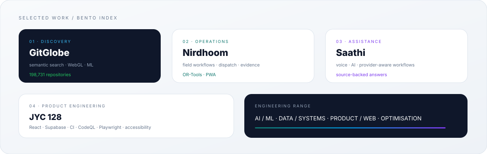

   

  
  
  

---

## Electronics & Computer Engineering student building useful systems

**JIIT Noida · AI · Data · Systems · Product · Open Source**

I build software where **AI, data, systems and real-world constraints** meet. My strongest work sits at the boundary between a technical idea and the messy conditions needed to make it useful.

My projects span open-source discovery, field operations, voice-first assistance, geospatial intelligence, security analysis and optimisation. I enjoy the whole engineering loop: **understand the problem → design the system → build it → test what can fail → ship what is actually true.**

---

## Mission brief

| Signal | Evidence |
|---|---|
| **Open-source discovery** | 198,731-repository semantic globe in GitGlobe |
| **Real-world operations** | Field-first residue coordination in Nirdhoom |
| **Voice + AI** | Source-backed, provider-aware assistance in Saathi |
| **Production web** | CI, CodeQL, accessibility and browser QA in JYC 128 |

---

## Selected work

### GitGlobe · Open-source discovery
**A 3D map of the open-source universe.**

GitGlobe places **198,731 repositories** on an interactive globe according to what they do rather than what they are called. It combines semantic embeddings, spherical UMAP, WebGL rendering, search, repository ranking and a popularity-blind quality model.

`React` `TypeScript` `Three.js` `FastAPI` `Qdrant` `PostgreSQL` `ML`

**[Repository →](https://github.com/kaustubhdua/GitGlobe)**

---

### Nirdhoom · Field operations
**Field → service → evidence → residue → buyer.**

A field-first crop-residue coordination platform built around an operational chain instead of another dashboard. It brings together field workflows, booking, dispatch, operator evidence, verification, residue pooling and an OR-Tools dispatch foundation.

`React` `Vite` `Supabase` `PostgreSQL` `Leaflet` `OR-Tools` `PWA`

**[Repository →](https://github.com/kaustubhdua/nihdhoom)**

---

### Saathi · Voice + AI
**Voice-first assistance for real-world workflows.**

A multilingual assistance platform built around source-backed answers, deterministic intent routing, provider adapters, consent, human escalation and measurable readiness gates. Simulated capabilities are deliberately separated from provider-backed ones.

`Next.js` `React` `FastAPI` `Python` `Voice` `AI`

**[Repository →](https://github.com/kaustubhdua/Saathi)**

---

### JYC 128 · Product engineering
**An editorial product for JIIT Youth Club.**

The official JYC 128 website combines content architecture, verified public records, media provenance, accessibility, SEO, responsive design, CI, CodeQL and browser QA.

`React` `Vite` `Supabase` `CI` `Playwright` `SEO` `Accessibility`

**[Repository →](https://github.com/kaustubhdua/JYC-Website)**

---

### Other work

| Project | Engineering signal |
|---|---|
| **[Satark](https://github.com/kaustubhdua/Satark)** | Security analysis, explainability and safer engineering workflows |
| **[AkashChalak](https://github.com/kaustubhdua/AkashChalak)** | Geospatial air-quality analysis and environmental intelligence |
| **[Smart Waste](https://github.com/kaustubhdua/smart_waste_project)** | ML prediction, priority scoring and vehicle-route optimisation |

**[Explore every repository →](https://github.com/kaustubhdua?tab=repositories)**

> **Repository rule:** project links above point to the live source repositories; the profile intentionally avoids presenting prototypes or simulated capabilities as production systems.

---

## Capability wall

| Capability | Working with |
|---|---|
| **AI / ML** | PyTorch · TensorFlow · embeddings · model evaluation · AI workflows |
| **Data / Systems** | Python · PostgreSQL · Supabase · Redis · APIs · data pipelines |
| **Product / Web** | React · Next.js · TypeScript · Vite · Three.js · Leaflet |
| **Optimisation** | OR-Tools · routing · prioritisation · constraint-based thinking |
| **Infrastructure** | Docker · GitHub Actions · CI · security boundaries · deployment |
| **Engineering practice** | Testing · documentation · provenance · accessibility · performance |

---

## Research interests

**AI systems** · **Data products** · **Geospatial computing** · **Optimisation** · **Automation** · **Developer experience**

I’m especially interested in problems where the clean diagram ends and reality begins: incomplete data, constrained resources, human workflows, uncertain inputs and systems that need to remain understandable.

---

## Current mission

| Signal | Focus |
|---|---|
| **Building** | Larger projects with stronger architecture, testing and product thinking |
| **Learning** | Systems fundamentals, machine learning, data engineering and production software |
| **Contributing** | Student-led open source and collaborative engineering work |
| **Looking for** | Strong engineering teams, serious projects and opportunities to learn by shipping |

---

## Build protocol

**01 · UNDERSTAND** → **02 · DESIGN** → **03 · BUILD** → **04 · TEST** → **05 · VERIFY** → **06 · SHIP**

I care about **clarity over cleverness, evidence over assumptions and useful software over feature count**.

---

## Open-source signal

- 🎓 **Electronics & Computer Engineering — JIIT Noida**
- 🌱 **GirlScript Summer of Code — 2026**
- 🤝 Student-led open-source collaboration
- 🧪 Learning through projects, reviews and experimentation

---

## Engineering dashboard

 

### Activity

 
Stats show activity; the selected projects above show engineering substance.

  

### Achievements

### Contribution activity

<a href="https://github.com/kaustubhdua"><picture><source media="(prefers-color-scheme: dark)" srcset="https://raw.githubusercontent.com/kaustubhdua/kaustubhdua/output/github-contribution-grid-snake-dark.svg"><source media="(prefers-color-scheme: light)" srcset="https://raw.githubusercontent.com/kaustubhdua/kaustubhdua/output/github-contribution-grid-snake.svg"></picture></a>

### Profile summary

---

### Build something useful.

**[GitHub](https://github.com/kaustubhdua)** · **[Repositories](https://github.com/kaustubhdua?tab=repositories)**

  

Electronics & Computer Engineering · builder · open-source learner

