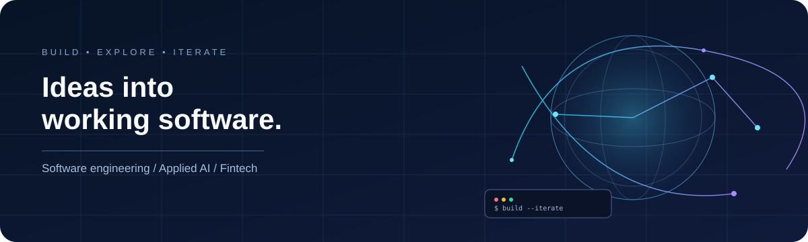

<h3>Electronics and Computer Science Engineering · JIIT Noida</h3>

  

<i>Turning ideas into working software, one iteration at a time.</i>

 &nbsp; 

  
  
  

<a href="#about">About</a> &nbsp;·&nbsp; <a href="#projects">Projects</a> &nbsp;·&nbsp; <a href="#toolbox">Tech stack</a> &nbsp;·&nbsp; <a href="#focus">Focus</a> &nbsp;·&nbsp; <a href="#community">Community</a> &nbsp;·&nbsp; <a href="#connect">Connect</a>

---

## Hey, I'm Kaustubh 👋

I'm pursuing **Electronics and Computer Science Engineering at Jaypee Institute of Information Technology (JIIT), Noida**. I like building useful software, exploring how systems work, and improving projects through iteration.

My interests include **software engineering, applied AI, data-driven products, and fintech**. Across my repositories, I've worked on web applications, local AI, geospatial data, route optimization, and data-structure-driven simulations.

## Selected projects

A quick tour of different problem spaces represented in my public repositories. Project descriptions reflect the repository documentation; check each repo for its current implementation and status.

<table>
  <tr>
    <td width="50%" valign="top">
      <h3><a href="https://github.com/kaustubhdua/nihdhoom">🌾 NIRDHOOM</a></h3>
      
Field-first agricultural operations concept connecting field activity, machinery workflows, evidence, residue handling, and records.

      React · JavaScript · TypeScript · Vite · Supabase · Leaflet · Three.js
    </td>
    <td width="50%" valign="top">
      <h3><a href="https://github.com/kaustubhdua/GitGlobe">🌐 GitGlobe</a></h3>
      
A 3D interactive globe for exploring open-source repositories by semantic similarity, with search, domain filters, and navigable visual discovery.

      Three.js · WebGL · Python · UMAP · embeddings · data pipelines
    </td>
  </tr>
  <tr>
    <td width="50%" valign="top">
      <h3><a href="https://github.com/kaustubhdua/adapt-ai">🧠 Adapt AI</a></h3>
      
A hardware-aware local AI assistant that profiles system memory, recommends locally runnable models, and provides chat, telemetry, file attachments, and Python execution.

      Python · FastAPI · Ollama · JavaScript · Tailwind · Chart.js
    </td>
    <td width="50%" valign="top">
      <h3><a href="https://github.com/kaustubhdua/Satark">🛡️ SATARK</a></h3>
      
A Streamlit security-awareness and threat-analysis app for examining suspicious messages, URLs, images, and documents with evidence-oriented results.

      Python · Streamlit · Groq · Pillow · pypdf · ReportLab
    </td>
  </tr>
  <tr>
    <td width="50%" valign="top">
      <h3><a href="https://github.com/kaustubhdua/Akash-Chalak">🛰️ AkashChalak</a></h3>
      
Satellite-assisted air-quality and hotspot decision-support prototype with live-source ingestion, spatial interpolation, and mapped results.

      Python · FastAPI · React · Leaflet · scikit-learn · PostgreSQL · TimescaleDB
    </td>
    <td width="50%" valign="top">
      <h3><a href="https://github.com/kaustubhdua/smart_waste_project">♻️ Smart Waste</a></h3>
      
Waste collection workflow combining IoT-style time-series data, fill-level prediction, priority scoring, and vehicle-route optimization.

      Python · Streamlit · Random Forest · OR-Tools · Folium · Pandas
    </td>
  </tr>
</table>

  
<b>More repositories</b>

   

  - **[JYC Website](https://github.com/kaustubhdua/JYC-Website)** — Club-first public website for JIIT Youth Club, with React, Vite, React Router, Supabase, Three.js, and a CSS-first interaction layer.
  - **[Smart Bike Taxi Platform](https://github.com/kaustubhdua/Smart_bike_taxi_platform)** — C++17 ride-booking simulation using Dijkstra routing, a custom hash table, FIFO requests, local persistence, CMake, and CTest.
  - **[Nord Studio Task Manager](https://github.com/kaustubhdua/nord-studio-task-manager)** — Lightweight task manager built with vanilla HTML, CSS, and JavaScript.
  - **[Weather Core Matrix](https://github.com/kaustubhdua/weather-core-matrix)** — Browser-based weather dashboard using vanilla HTML, CSS, and JavaScript.
  - **[AkashChalak (alternate repository)](https://github.com/kaustubhdua/AkashChalak)** — Alternate repository for the air-quality prototype; see both repository histories before treating them as separate projects.
  - **[GitHub Skills exercise](https://github.com/kaustubhdua/skills-introduction-to-github)** — Repository used for a GitHub learning exercise.

## 🧰 Technology stack

<i>A snapshot of the tools used across my projects — grouped by what I build with them.</i>

  
  
  
  
  

  

<table>
<tr><td width="50%" valign="top">

### ⚡ Languages & foundations

C++17 · Python · JavaScript · TypeScript · HTML5 · CSS3 · SQL

### 🎨 Frontend & interactive UI

React · Vite · Three.js · React Three Fiber · Drei · Framer Motion · React Router · TanStack Query · Zustand · Leaflet · Chart.js · Lucide

### 🗄️ Backend & databases

FastAPI · Supabase · PostgreSQL · SQLAlchemy · Pydantic · Qdrant · Redis · Docker Compose

</td><td width="50%" valign="top">

### 🧠 AI, ML & data

TensorFlow · scikit-learn · NumPy · Pandas · Joblib · Ollama · Groq · UMAP · HDBSCAN · Prefect · BigQuery · HTTPX

### 🌍 Geospatial & optimization

GeoPandas · Rasterio · xarray · netCDF4 · Google Earth Engine · CDS API · Folium · OR-Tools · Dijkstra

### 🧪 Testing, build & delivery

GitHub Actions · Playwright · Vitest · CMake · CTest · Vercel · Oxlint · Pillow · pypdf · ReportLab

</td></tr>
</table>

<b>📦 Explore technologies by repository</b>

| Repository | Technologies represented |
| --- | --- |
| **NIRDHOOM** | React, JavaScript, TypeScript, Vite, Supabase, Leaflet, Three.js, FastAPI, OR-Tools |
| **GitGlobe** | React, TypeScript, Vite, Three.js, Framer Motion, TanStack Query, Zustand, Python, UMAP, HDBSCAN, Qdrant, Redis, Prefect, BigQuery |
| **Adapt AI** | Python, FastAPI, Ollama, JavaScript, Tailwind CSS, Chart.js, psutil, GPUtil |
| **SATARK** | Python, Streamlit, Groq, OpenCV, Pillow, pypdf, ReportLab |
| **AkashChalak** | Python, FastAPI, React, Leaflet, scikit-learn, TensorFlow, PostgreSQL, GeoPandas, Rasterio, xarray, netCDF4 |
| **Smart Waste** | Python, Streamlit, scikit-learn, NumPy, Pandas, Folium, OR-Tools |
| **JYC Website** | React, Vite, React Router, Supabase, Three.js |
| **Smart Bike Taxi Platform** | C++17, CMake, CTest, Dijkstra, custom hash table, FIFO queue |
| **Nord Studio Task Manager** | HTML, CSS, JavaScript |
| **Weather Core Matrix** | HTML, CSS, JavaScript |

Technologies are shown because they appear in project files or documentation; this is a project map, not a proficiency ranking.

## What I'm focused on

| Area | Current direction |
| --- | --- |
| **DSA & systems** | Strengthening fundamentals through C++ and structured problem solving. |
| **Full-stack development** | Building responsive interfaces and connecting them to reliable backend services. |
| **Applied AI** | Exploring local inference, AI-assisted workflows, and data-driven applications. |
| **Engineering quality** | Improving modularity, validation, tests, documentation, and CI. |
| **Open source** | Learning through collaboration, code review, and useful contributions. |

## Open source & community

- Contributor to **GirlScript Summer of Code (GSSoC) 2026**.
- Interested in student-led development, collaborative problem-solving, and learning from maintainers.

I value useful, well-scoped contributions and thoughtful feedback.

## GitHub activity

Recent work and contribution activity, presented with lightweight stats.

  
    
  
    

Activity cards are third-party visualizations and may have caching delays or service interruptions.

## Contribution animation

  <picture>
    <source media="(prefers-color-scheme: dark)" srcset="https://raw.githubusercontent.com/kaustubhdua/Coolbandariya/output/github-contribution-grid-snake-dark.svg">
    <source media="(prefers-color-scheme: light)" srcset="https://raw.githubusercontent.com/kaustubhdua/Coolbandariya/output/github-contribution-grid-snake.svg">
    
  </picture>

## Connect

  
    
  Interested in a project or have constructive feedback? Browse the repositories and connect through GitHub.

